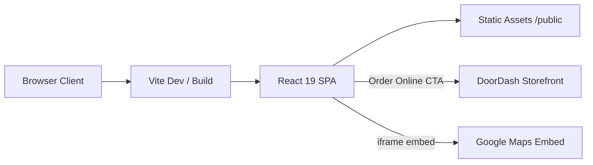

# UFoodieHotPot


## The Hook

Marketing site for U Foodie, an Anaheim Szechuan hot pot and malatang restaurant. Converts walk-by and search traffic into dine-in visits and DoorDash pickup orders by surfacing menu, pricing, location, and social proof in a single scroll experience.

## System Architecture



## Key Features & Metrics

- **Zero-backend static SPA** — no API layer; all content is component-local data and `/public` assets, minimizing hosting cost and attack surface.
- **Menu catalog** — 2 clear broths, 3 bold broths, 1 signature dry bowl (Mala Ban); pricing surfaced at **$11.99/lb** with **1 lb minimum**.
- **Scroll-triggered animations** — custom `FadeUp` uses `IntersectionObserver` at **threshold 0.15**, **700ms** ease-out transitions; observer disconnects after first intersection to avoid repeat work.
- **Mobile conversion bar** — fixed bottom CTA (`md:hidden`, `z-50`, `min-h-14`) routes to DoorDash; desktop uses inline hero CTAs.

## Technical Implementation Notes

- **Tailwind v4 via Vite plugin** — `@tailwindcss/vite` replaces PostCSS pipeline; design tokens live in `index.css` (`@layer base/components`).
- **External dependency trade-off** — ordering and maps are delegated to DoorDash and Google Maps iframe embeds; no first-party checkout or geolocation API.
- **Responsive layout split** — `LocationSplit` uses `md:grid-cols-2` with `min-h-[400px]` map panel; sticky mobile bar adds `pb-24` padding on `<main>` to prevent overlap.
- **Hard-coded business data** — address, hours (4:00 PM–11:00 PM daily), phone, and 4.9★ / 99-review rating are inline constants, not CMS-driven.

## Local Deployment

```bash
npm install
npm run dev
```

Production preview:

```bash
npm run build
npm run preview
```

## Project Structure

```
UFoodieHotPot/
├── public/                  # Hero, menu, ingredient images
├── src/
│   ├── App.jsx              # Page composition
│   ├── index.css            # Tailwind layers, button/section tokens
│   └── components/
│       ├── Hero.jsx         # Full-bleed hero + DoorDash CTA
│       ├── Menu.jsx         # Broth catalog + pricing
│       ├── HowItWorks.jsx   # 4-step malatang flow
│       ├── LocationSplit.jsx# Address + Google Maps iframe
│       ├── FadeUp.jsx       # IntersectionObserver animation
│       ├── MobileStickyBar.jsx
│       ├── Navbar.jsx
│       └── Footer.jsx
├── index.html
├── vite.config.js
└── package.json
```
